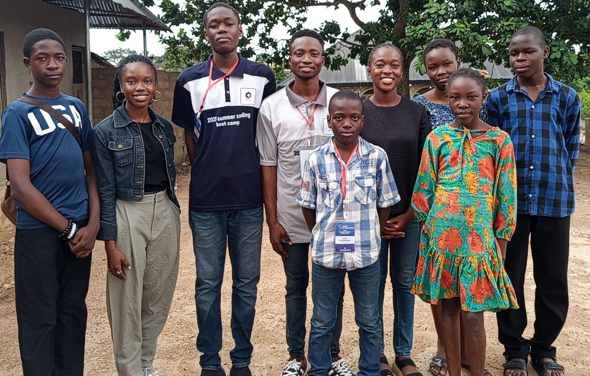
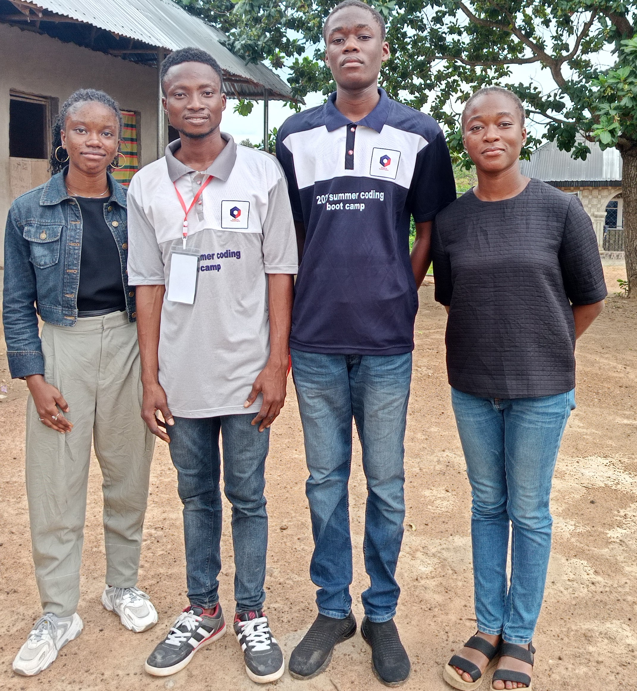

<section class="gallery-section">
            

                

                    <h2 class="section-title">Our Gallery</h2>
                    
Moments from our training sessions, workshops, and community impact

                

                

                    <!-- Keep ALL your gallery-item blocks here (even if they are 20).
       JS will show only the first 6 on the homepage. -->

                    

                        
                        

                            
All participants at Future Skills Bootcamp 2025

                        

                    

                    

                        
                        

                            
Squad Leaders and Instructors at Future Skills Bootcamp 2025

                        

                    

                    

                        
                        

                            
Learners at Future Skills Bootcamp 2025

                        

                    

                    <!-- Duplicate .gallery-item for the rest -->
                

                

                    <a href="gallery.html" class="btn btn-secondary">View Full Gallery</a>
                

            

        </section>
